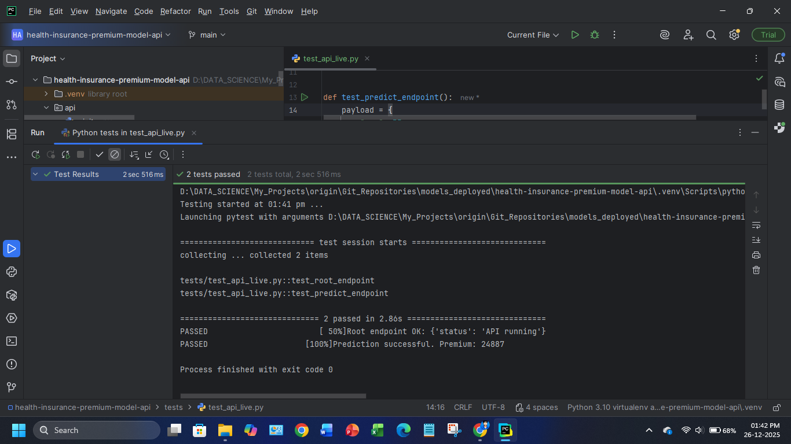
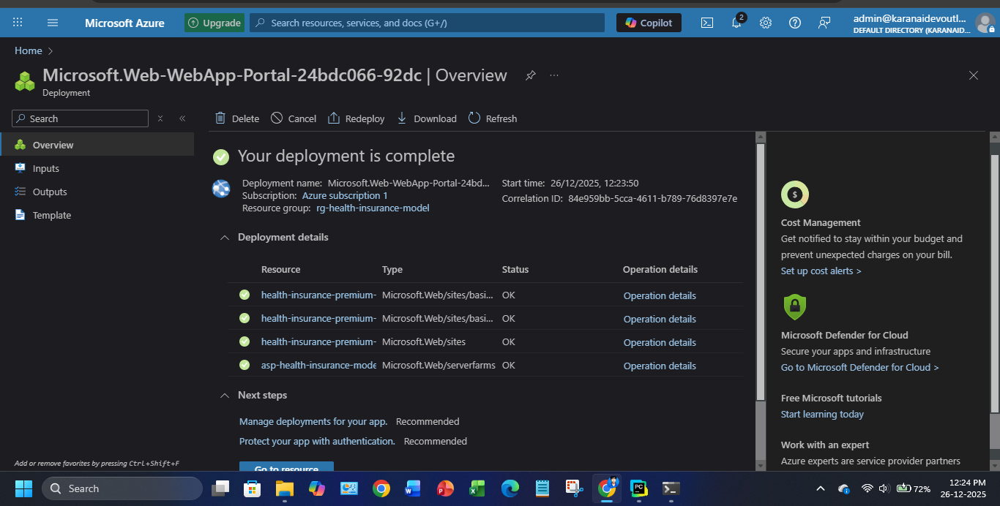

# Health Insurance Premium ML - Model 

A production-grade machine learning inference service for predicting health insurance premiums.
The model is exposed as a REST API using FastAPI and is designed to be consumed by any client
(web applications, backend services, mobile apps, or external systems).

---
This repository contains only the model inference layer.
No UI or frontend logic is included.

Refer below for UI or frontend logic & Live app test

---
- REPO: For model Deployment: Main model Repo 

https://github.com/AI-Solutions-KK/health-insurance-premium-model-api.git


- REPO : UI-APP - Practical Model use case 

https://github.com/AI-Solutions-KK/health-insurance-premium-prediction-ui.git


- APP : Live Deployed App: Model Test 

https://health-insurance-premium-ui-gvhvh4esfqe9emb5.centralindia-01.azurewebsites.net/

---
---
## Local Test Passed


---
## Deployment Successful


---

## Model is live


---

## Live Test Passed


## 🔐 API Management (APIM)


This project uses **API Management (APIM)** as a secure gateway in front of the machine learning model.

### Purpose of APIM
- Prevents direct public access to the model service
- Enforces **API key–based authentication**
- Enables rate limiting, monitoring, and future versioning
- Protects model infrastructure and intellectual property

### Access Flow
```text
Client (Web / Mobile / Backend)
        |
        |  HTTPS (JSON) + Subscription Key
        v
Azure API Management (APIM)
        |
        v
FastAPI Model Inference Service
        |
        v
Trained ML Models + Scalers

---

This service predicts health insurance premiums based on:
- Demographics
- Income
- Lifestyle factors
- Medical history
- Insurance plan selection

---

## Architecture Overview
````
Client (Web / Mobile / Backend)
        |
        |  HTTP (JSON)
        v
FastAPI Model Inference Service
        |
        v
Trained ML Models + Scalers

---
````
## Project Structure

health-insurance-premium-model-api/
├── api/
│   ├── __init__.py
│   ├── main.py
│   ├── inference.py
│   └── schemas.py
├── artifacts/
├── tests/
├── requirements.txt
├── README.md
├── LICENSE
└── .gitignore

---
````
## Running the API Locally
````
pip install -r requirements.txt
uvicorn api.main:app --reload

---
````
## API Usage
````
POST /predict

Request:
{
  "age": 30,
  "dependants": 2,
  "income": 12,
  "genetical_risk": 1,
  "insurance_plan": "Gold",
  "gender": "Male",
  "marital_status": "Married",
  "employment_status": "Salaried",
  "bmi": "Overweight",
  "smoking": "No Smoking",
  "region": "Southwest",
  "medical_history": "Diabetes"
}

Response:
{
  "predicted_premium": 5994
}

---
````
## Example: Python Client
````
import requests

BASE_URL = "https://health-insurance-premium-model-api-bvgrg3bmcyhbbpb4.centralindia-01.azurewebsites.net"

def test_root_endpoint():
    response = requests.get(f"{BASE_URL}/")
    assert response.status_code == 200
    data = response.json()
    assert "status" in data
    print("Root endpoint OK:", data)


def test_predict_endpoint():
    payload = {
        "age": 35,
        "dependants": 2,
        "income": 15,
        "genetical_risk": 1,
        "insurance_plan": "Gold",
        "gender": "Male",
        "marital_status": "Married",
        "employment_status": "Salaried",
        "bmi": "Overweight",
        "smoking": "Occasional",
        "region": "Southwest",
        "medical_history": "Diabetes"
    }

    response = requests.post(f"{BASE_URL}/predict", json=payload)

    assert response.status_code == 200
    data = response.json()

    assert "predicted_premium" in data
    assert isinstance(data["predicted_premium"], (int, float))
    assert data["predicted_premium"] > 0

    print("Prediction successful. Premium:", data["predicted_premium"])


````
## Output  
````
============================= test session starts =============================
collecting ... collected 2 items

tests/test_api_live.py::test_root_endpoint 
tests/test_api_live.py::test_predict_endpoint 

============================== 2 passed in 2.86s ==============================
PASSED                        [ 50%]Root endpoint OK: {'status': 'API running'}
PASSED                     [100%]Prediction successful. Premium: 24887

Process finished with exit code 0
````
## Note:
Can be used in any app web / mobile-(html / django/ streamlit /...other, Mobile or other platforms)
## License

MIT License

Author : - Karan KK (AI-Solution)